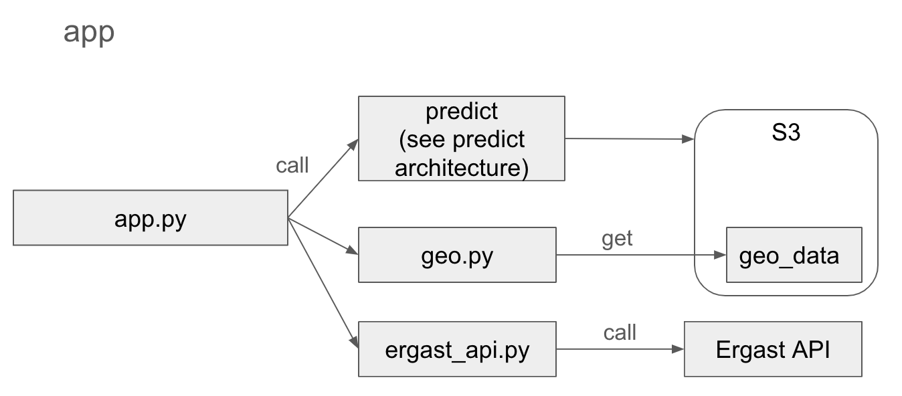
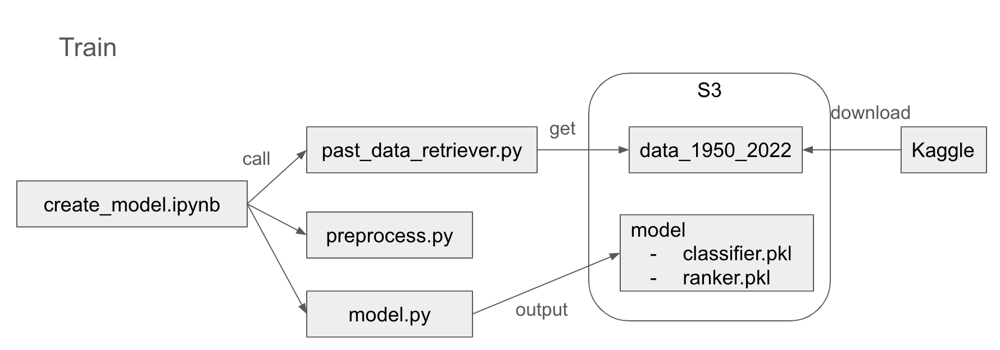
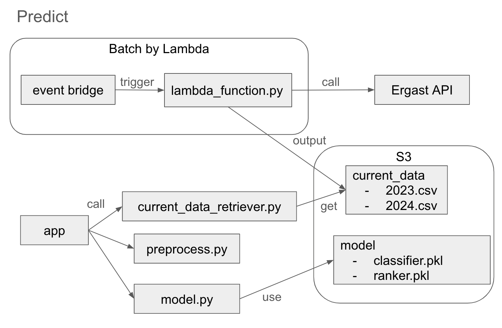

# formula1-season-explorer

This README document is a personal note for hobby development purposes. It is intended for future reference when revisiting or updating the project. This document is not designed to instruct or guide a general audience.

## Environment　Setup

Install required packages with the command: pip install -r requirements.txt.

## Application Architecture

- __Functionality__: The application provides
  - Predictions for race results.
  - Circuit layouts via `geo.py`.
  - Race schedules and previous year results through `ergast_api.py`.

- __Model Training__: A model is trained with historical data spanning from the 1950 to the 2022 season, using a notebook. The trained model is stored in an S3 bucket.

- __Data Updates__: To minimize app downtime, the latest race results are fetched using a Lambda function triggered by an EventBridge event.
- __Prediction__: The app utilizes the latest data to predict future race outcomes with the pre-trained model.

## Data source

- Circuit layouts: [Geo data](https://github.com/bacinger/f1-circuits/tree/master)

- Historical race data: [Past data on Kaggle](https://www.kaggle.com/datasets/rohanrao/formula-1-world-championship-1950-2020)

- Recent race results (not included in the static dataset) are fetched from [Ergast API](https://ergast.com/mrd/).

## TODO

- Due to the scheduled shutdown of the Ergast API at the end of 2024, a new API or data source will be required for the 2025 season onwards.